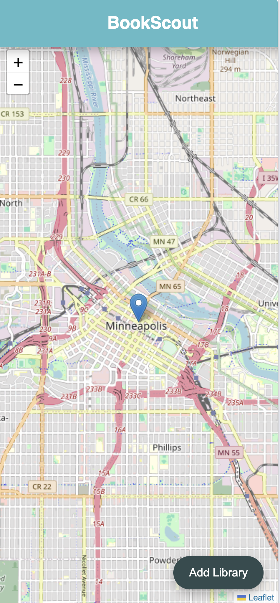
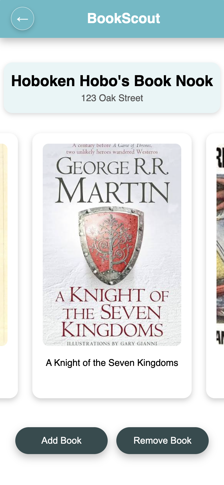
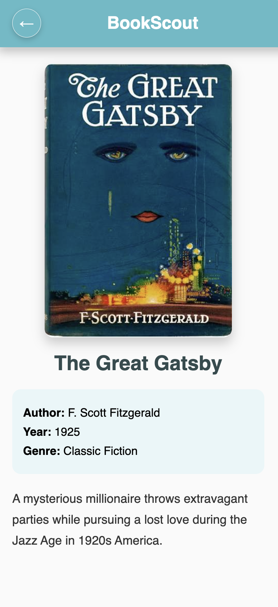

# BookScout

BookScout is a mobile-first web application that helps users discover and explore Little Free Libraries in their community. Users can browse nearby libraries on an interactive map, view available books before visiting, and help keep library collections updated through simple inventory management tools.


## Screenshots

| Home / Map | Library | Book Details |
|------------|----------|--------------|
|  |  |  |


## Features

### Discover Nearby Libraries
BookScout helps users explore Little Free Libraries in their community and decide which locations to visit. Users can browse library locations, view library information, and explore available books before making a trip.

### Browse Library Collections
Each library has its own collection of books that users can explore. BookScout allows readers to browse available titles, view book details, and discover new reading options from their local community.

### Manage Library Inventory
Library owners and community members can help keep collections updated by adding and removing books as inventory changes. This helps provide a more accurate view of what books are currently available at each location.

### Personalized Reading Experience
Future versions of BookScout will expand discovery features by allowing users to search and filter books, save favorite libraries, and receive recommendations based on their interests.

### Community Engagement
BookScout aims to strengthen local reading communities by making it easier for people to share books, discover neighborhood resources, and participate in Little Free Library networks.


## User Experience

BookScout was designed around several different community members who interact with Little Free Libraries in different ways. These users helped guide design decisions focused on accessibility, simplicity, and making book discovery easier.

### **JoAnn (80) — Retired Grandmother**
JoAnn visits her neighborhood Little Free Library every week during her walks. She enjoys mystery and historical fiction and wants a simple way to see what books are available before making the trip.

### **David (39) — Parent and Community Reader**
David visits Little Free Libraries with his children as part of their weekend walks. He uses BookScout to find children's books, discover new reading options, and donate books his family has finished.

### **Alex (21) — College Student and Avid Reader**
Alex enjoys fantasy and science fiction but prefers free and accessible ways to find books. As someone who frequently uses mobile applications and bikes around town, Alex benefits from quickly discovering nearby libraries.

### **Thomas (58) — Book Collector**
Thomas enjoys exploring bookstores, library sales, and Little Free Libraries in search of unique finds. BookScout helps him discover new collections and find interesting books within his community.

### **Susan (44) — Little Free Library Steward**
Susan maintains a Little Free Library in her neighborhood and wants to encourage community engagement. BookScout helps stewards keep inventory organized and provides a better way to understand what books are available in their libraries.

These personas influenced several design decisions:

- Mobile-first interface for users exploring libraries while walking or biking.
- Simple navigation with minimal steps.
- Large, touch-friendly controls.
- Visual book browsing through cover images.
- Easy inventory management for community members and library stewards.


## Future Improvements

Planned features include:

- ISBN barcode scanning for quickly adding books (cover scanning ?)
- Automatic book information lookup from external book databases
- Search and filtering by title, author, or genre
- Favorite libraries and personalized reading lists
- User accounts for readers and Little Free Library stewards
- Library activity statistics and inventory insights
- Inventory history and tracking
- Expanding the initial library dataset
- Additional community features to encourage book sharing and discovery

## For Developers

BookScout is built as a full-stack application with a React frontend, Express backend, and PostgreSQL database.


## Technologies Used

### Frontend
- React
- React Router DOM
- React Leaflet (Interactive Maps)
- Vite
- CSS

### Backend
- Node.js
- Express.js
- PostgreSQL
- REST API

### Development Tools
- GitHub
- Render (Deployment)


## Installation

Clone the repository:

```bash
git clone <repository-url>
```

Install frontend dependencies:

```bash
npm install
```

Install backend dependencies:

```bash
cd server
npm install
```

Run the frontend server:

```bash
npm run dev
```

Run the backend server:

```bash
node server.js
```


## Developer Notes

BookScout is currently a working full-stack prototype with a React frontend, Express API, and PostgreSQL database. The application supports retrieving, adding, and removing library books through the backend API.

Future development will focus on expanding book discovery features, improving community interaction, and integrating additional technologies such as ISBN scanning and location-based features.